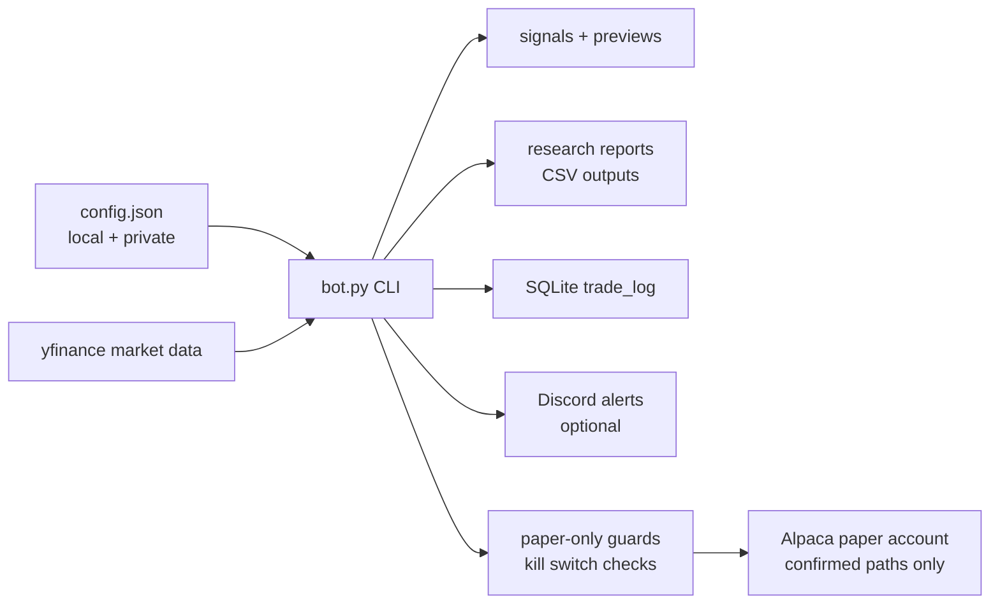

# Paper Trading Bot


A safety-first Python research and paper-trading workspace for testing market signals, producing monitoring reports, and rehearsing paper-order workflows without drifting into live trading.

The project started as a simple moving-average bot, then grew into a controlled research lab: strategy backtests, paper-readiness checks, risk previews, Discord monitoring, SQLite audit trails, and explicit kill-switch gates around anything that could touch Alpaca paper orders.

> **Important:** this is a learning and paper-trading project. It is not financial advice, does not guarantee profit, and is deliberately designed to avoid live trading.

## Why It Looks The Way It Does

Most trading-bot repos either hide the risky parts or make execution look too easy. This one does the opposite: every serious workflow is separated into preview, report, readiness, and explicitly confirmed paper-execution paths.

The goal is not "press button, make money." The goal is disciplined iteration:

- research before promotion,
- preview before execution,
- paper-only before anything else,
- saved evidence before manual decisions,
- no secrets or generated trading data committed to Git.

## What It Can Do

| Area | What is implemented |
| --- | --- |
| Market monitoring | Pulls daily market data with `yfinance`, calculates signals, logs decisions, and can send Discord summaries. |
| Paper safety | Keeps Alpaca in paper mode, defaults to `dry_run`, blocks live mode, and gates paper-order paths behind explicit confirmation. |
| Research | Runs SMA, ETF rotation, adaptive momentum, QQQ trend-gate, crypto, defensive, high-growth, and multi-sleeve research reports. |
| Backtesting | Writes CSV outputs for strategy comparisons, equity curves, robustness checks, stress tests, and walk-forward style reviews. |
| Auditability | Stores trade decisions in SQLite and writes saved CSV reports for paper-readiness, risk, monitoring, and review checkpoints. |
| Operations | Includes VPS/Hermes monitoring readiness docs and report-only scheduling checks. |

## Safety Defaults

The default configuration is intentionally conservative:

```json
{
  "dry_run": true,
  "allow_shorting": false,
  "paper_kill_switch_enabled": false,
  "alpaca": {
    "paper": true
  }
}
```

The normal command:

```powershell
python bot.py
```

is monitoring-only. It may log intended actions as `monitor_only`, but it does not submit Alpaca orders or mutate live position state.

Paper-order paths are separate commands and require explicit confirmation flags. Live Alpaca mode is refused.

## Project Map

```text
paper-trading-bot/
|-- bot.py                         # Main CLI entrypoint
|-- trading_bot/                   # Config, execution, data, strategies, research modules
|   |-- strategies/                # Strategy definitions and registry
|   |-- research/                  # Backtests, reports, readiness checks, dashboards
|   `-- safety/                    # Kill switch, lockfile, QQQ100 paper-execution guards
|-- scripts/                       # Static verifiers and focused readiness checks
|-- docs/                          # Current state, runbooks, VPS/Hermes docs, command reference
|-- tests/                         # Unit tests for config, execution, paper evidence, QQQ100 alignment
|-- data/                          # Generated outputs, ignored except .gitkeep
`-- logs/                          # Runtime logs, ignored except .gitkeep
```

## Quick Start

### 1. Create a virtual environment

```powershell
python -m venv .venv
.\.venv\Scripts\Activate.ps1
python -m pip install --upgrade pip
python -m pip install -r requirements.txt
```

### 2. Create a local config

```powershell
Copy-Item config.example.json config.json
```

Keep `config.json` private. It is intentionally ignored by Git.

### 3. Run monitoring-only mode

```powershell
python bot.py
```

### 4. Run a research command

```powershell
python bot.py --compare-strategies
python bot.py --research-report
python bot.py --preview-promoted-strategies
```

### 5. Check repo safety before publishing

```powershell
python scripts\verify_repo_safety.py
```

## Common Workflows

| Goal | Command |
| --- | --- |
| Run normal monitoring | `python bot.py` |
| Run strategy comparison | `python bot.py --compare-strategies` |
| Build research ranking report | `python bot.py --research-report` |
| Preview promoted strategy signals | `python bot.py --preview-promoted-strategies` |
| Preview promoted account actions | `python bot.py --preview-promoted-actions` |
| Show saved promoted risk preview | `python bot.py --show-promoted-risk` |
| Refresh promoted review chain | `python bot.py --refresh-promoted-review` |
| Build crypto research state report | `python bot.py --crypto-research-state-report` |
| Check deployment readiness | `python bot.py --deployment-readiness-report` |
| Verify repo safety | `python scripts\verify_repo_safety.py` |


The full command catalogue lives in [docs/COMMAND_REFERENCE.md](docs/COMMAND_REFERENCE.md).
QQQ100 daily decision monitoring is included in the VPS status outputs. The saved-output-only command `python bot.py --qqq100-daily-decision-report` can report `qqq100_daily_decision_hold_no_action_aligned_long` when QQQ100 is already aligned long one share; `python bot.py --vps-monitoring-status` and `python bot.py --vps-daily-monitoring-summary` surface that status without approving execution, repeat/follow-up orders, or scheduling.

QQQ100 manual flatten readiness is also saved-output-only. `python bot.py --qqq100-manual-flatten-readiness-report` and `python bot.py --show-qqq100-manual-flatten-readiness-report` document whether a future flat signal would need a separate manual flatten discussion; the current aligned-long state should report `flatten_not_needed_currently`, and the report does not approve execution.

The companion runbook/design checkpoint is `python bot.py --qqq100-manual-flatten-runbook-report`. It should report `manual_flatten_runbook_not_needed_currently` while QQQ100 remains aligned long one share, and it still does not create order instructions or approve a flatten action.

Paper-live promotion ladder status is report-only: `python bot.py --paper-live-promotion-ladder-status` reads saved ladder/monitoring outputs, reports the volatility-targeted growth candidate as the current report/status seed, and keeps QQQ100 as previous-seed context while high-growth and crypto remain research-only, defensive sleeves remain future-review-only, and portfolio backtests remain not promotion evidence. The F7 accounting proof is accepted as a static accounting checkpoint, but it does not approve promotion or execution.

Paper-live F7 accounting proof is report-only: `python bot.py --paper-live-f7-accounting-proof` statically checks that the multi-sleeve portfolio backtest uses weighted daily returns and no independent starting cash. The current proof has been accepted for the accounting checkpoint, while portfolio backtests still require separate promotion review before they can be treated as promotion evidence.

Paper-live next ladder candidate scope is report-only: `python bot.py --paper-live-next-ladder-candidate-scope` records defensive sleeve as the next conservative review scope, keeps the multi-sleeve allocator behind later review, and keeps high-growth research-only. It does not promote anything or approve orders.

Paper-live defensive sleeve ladder-scope review is report-only: `python bot.py --paper-live-defensive-sleeve-ladder-scope-review` checks saved defensive evidence file presence and reports whether a future defensive candidate discussion is even ready for manual review. The defensive sleeve is not promoted and no orders are approved.

Paper-live defensive sleeve manual review is also saved-output/report-only: `python bot.py --paper-live-defensive-sleeve-manual-review` summarizes the complete defensive evidence stack, keeps `qqq_100_trend_gate` as the clean paper-live lead, and records `defensive_sleeve_manual_review_required` without approving preview, promotion, orders, or scheduling.

Paper-live defensive sleeve preview-readiness is the next blocked checkpoint: `python bot.py --paper-live-defensive-sleeve-preview-readiness` records `defensive_sleeve_preview_candidate_not_approved_manual_review_required`. This is intentionally not a preview implementation; the defensive sleeve remains research-only until a separate manual decision changes that label.

Paper-live defensive sleeve evidence-quality review is saved-output-only: `python bot.py --paper-live-defensive-sleeve-evidence-quality` focuses the manual review on split sensitivity, full-period drawdown, allocation-decision blockers, and the QQQ100 role boundary. It does not approve defensive preview design, promotion, execution, orders, or scheduling.

High-growth strategy discovery sprint is saved-output-only: `python bot.py --high-growth-strategy-discovery-sprint` and `python bot.py --show-high-growth-strategy-discovery-sprint` consolidate existing high-growth stock, crypto, QQQ100, and multi-sleeve evidence into subagent-style workstreams. Current saved output reports `high_growth_strategy_discovery_two_or_more_strong_candidates_found`, with `higher_growth_70_20_5_5` and `qqq100_plus_high_growth_plus_crypto_research` as the top two research candidates, while standalone high-growth/crypto drawdown-heavy references remain fragile. This does not approve preview promotion, paper execution, order instructions, or scheduling.

Higher-growth preview readiness is also saved-output-only: `python bot.py --higher-growth-preview-readiness-pack` and `python bot.py --show-higher-growth-preview-readiness-pack` compare `higher_growth_70_20_5_5` against the clean QQQ100 baseline and `balanced_multi_sleeve_research_portfolio`. Current saved status is `higher_growth_preview_discussion_ready_manual_review_required`; preview implementation, paper execution, order instructions, and scheduling remain unapproved.

Higher-growth candidate selection is the follow-up saved-output decision: `python bot.py --higher-growth-candidate-selection-decision` and `python bot.py --show-higher-growth-candidate-selection-decision` select `higher_growth_70_20_5_5` for future preview-design review, keep `balanced_multi_sleeve_research_portfolio` as the calmer runner-up, and defer `qqq100_plus_high_growth_plus_crypto_research` behind crypto policy review. This still does not implement preview mode or approve execution.

Higher-growth preview design is the next saved-output checkpoint: `python bot.py --higher-growth-preview-design` and `python bot.py --show-higher-growth-preview-design` document the future preview-only shape for `higher_growth_70_20_5_5`: 70% QQQ100 core, 20% high-growth stock research sleeve, 5% crypto research sleeve, and 5% defensive cash/bond sleeve. It creates no preview signal, no action preview, no order instructions, and no execution approval.

Volatility-targeted growth research sprint is saved-output-only: `python bot.py --vol-targeted-growth-research-sprint` and `python bot.py --show-vol-targeted-growth-research-sprint` test QQQ100, high-growth, crypto, drawdown-control, and multi-sleeve volatility-targeted variants from saved return streams. Current saved status is `vol_targeted_growth_research_two_or_more_strong_candidates_found`, with `high_growth_balanced_target_vol_25_win_20_cap_1x` and `higher_growth_multi_sleeve_target_vol_15_win_20_cap_1x` as the top two distinct research candidates. It does not create preview signals, order instructions, execution approval, or scheduling approval.

Volatility-targeted growth manual review is also saved-output-only: `python bot.py --vol-targeted-growth-manual-review-pack` and `python bot.py --show-vol-targeted-growth-manual-review-pack` compare the two leading volatility-targeted candidates side by side. Current interpretation favours `higher_growth_multi_sleeve_target_vol_15_win_20_cap_1x` as the cleaner next research path, while `high_growth_balanced_target_vol_25_win_20_cap_1x` remains a higher-return/higher-risk branch requiring drawdown, concentration, and outlier review. Preview implementation, paper execution, order instructions, and scheduling remain unapproved.

Volatility-targeted growth robustness checkpoint is saved-output-only: `python bot.py --vol-targeted-growth-robustness-checkpoint` and `python bot.py --show-vol-targeted-growth-robustness-checkpoint` review parameter-neighbourhood, split stability, drawdown tradeoff, and QQQ100/balanced comparator context for `higher_growth_multi_sleeve_target_vol_15_win_20_cap_1x`. It keeps preview design blocked pending manual review and does not approve preview signals, order instructions, execution, or scheduling.

Volatility-targeted growth nearby-variants review is saved-output-only: `python bot.py --vol-targeted-growth-nearby-variants-review` and `python bot.py --show-vol-targeted-growth-nearby-variants-review` compare the preferred 15% target / 20-day window against adjacent multi-sleeve volatility-targeted variants. Current interpretation keeps `higher_growth_multi_sleeve_target_vol_15_win_20_cap_1x` as the best risk-adjusted variant, while `higher_growth_multi_sleeve_target_vol_20_win_20_cap_1x` is the nearest higher-volatility step and `higher_growth_multi_sleeve_target_vol_25_win_20_cap_1x` is the highest-CAGR/higher-drawdown challenger. Preview implementation, paper execution, order instructions, and scheduling remain unapproved.

Volatility-targeted growth preview-readiness decision is saved-output-only: `python bot.py --vol-targeted-growth-preview-readiness-decision` and `python bot.py --show-vol-targeted-growth-preview-readiness-decision` select `higher_growth_multi_sleeve_target_vol_15_win_20_cap_1x` for a future preview-design review, keep `20/20` and `25/20` as challengers, and record `preview_design_discussion_ready_manual_review_required`. It still does not implement preview mode, create preview signals or order instructions, approve execution, or approve scheduling.

Volatility-targeted growth preview design is the next saved-output checkpoint: `python bot.py --vol-targeted-growth-preview-design` and `python bot.py --show-vol-targeted-growth-preview-design` document a future preview-only shape for `higher_growth_multi_sleeve_target_vol_15_win_20_cap_1x`: higher-growth multi-sleeve base allocation, 15% volatility target, 20-day volatility window, 1x exposure cap, no leverage, and saved candidate/weight/status/blocker outputs only. It creates no preview signal, no action preview, no order instructions, and no execution approval.

Volatility-targeted growth preview signal is saved-output-only: `python bot.py --vol-targeted-growth-preview-signal` and `python bot.py --show-vol-targeted-growth-preview-signal` write the selected 15% target / 20-day candidate identity, sleeve target weights, volatility settings, blockers, and safety flags from saved design evidence only. It creates no action preview, no order side/quantity/type/account fields, no broker calls, no execution approval, and no scheduling approval.

Volatility-targeted growth action-preview design is saved-output-only: `python bot.py --vol-targeted-growth-action-preview-design` and `python bot.py --show-vol-targeted-growth-action-preview-design` review the saved preview signal and document the shape of a possible future action-preview checkpoint. It creates no action preview rows, reads no broker positions, includes no order side/quantity/type/account fields, and does not approve execution or scheduling.

Volatility-targeted growth action preview is saved-output-only: `python bot.py --vol-targeted-growth-action-preview` and `python bot.py --show-vol-targeted-growth-action-preview` create sleeve-level manual-review rows from the saved 15/20 preview signal. Current exposure is deliberately `current_exposure_not_read`; it reads no broker positions, includes no order side/quantity/type/account fields, and does not approve execution or scheduling.

Volatility-targeted growth broker-position comparison design is report-only: `python bot.py --vol-targeted-growth-broker-position-comparison-design` and `python bot.py --show-vol-targeted-growth-broker-position-comparison-design` document the future safety gates for an explicit read-only broker comparison. It does not call Alpaca, read positions, create orders, or approve execution.

Volatility-targeted growth portfolio-risk review is saved-output-only: `python bot.py --vol-targeted-growth-portfolio-risk-review` and `python bot.py --show-vol-targeted-growth-portfolio-risk-review` keeps the 15/20 candidate research-only until broker comparison and portfolio risk policy are reviewed. It does not approve paper-live candidacy, execution, or scheduling.

Volatility-targeted growth portfolio-risk policy design is saved-output-only: `python bot.py --vol-targeted-growth-portfolio-risk-policy-design` and `python bot.py --show-vol-targeted-growth-portfolio-risk-policy-design` proposes guardrails for the 15/20 candidate, including zero allocation until approval, crypto capped at 5%, high-growth remaining research-only, drawdown review, and broker-position review. It does not enforce policy or approve paper-live candidacy.

Volatility-targeted growth paper-live decision is saved-output-only: `python bot.py --vol-targeted-growth-paper-live-decision` and `python bot.py --show-vol-targeted-growth-paper-live-decision` keeps the 15/20 candidate research-only while marking it ready for manual discussion of a future read-only broker-position comparison. It does not call Alpaca, read positions, create order instructions, approve paper-live candidacy, or approve scheduling.

Volatility-targeted growth broker-comparison run-readiness is saved-output-only: `python bot.py --vol-targeted-growth-broker-comparison-run-readiness` and `python bot.py --show-vol-targeted-growth-broker-comparison-run-readiness` checks whether the project is ready to request explicit manual approval for a future read-only broker-position comparison. It does not grant that approval, call Alpaca, read positions, approve paper-live candidacy, create order instructions, or approve scheduling.

Volatility-targeted growth broker-position comparison is read-only/manual-review: `python bot.py --vol-targeted-growth-broker-position-comparison` writes a safe blocked report unless `--confirm-readonly-alpaca-check` is supplied in a separately approved run. The strategy is a research-only multi-sleeve growth portfolio: 70% QQQ100 core trend, 20% high-growth research, 5% crypto research, and 5% defensive buffer, with a 15% volatility target over a 20-day window and a 1x exposure cap. The command compares saved target sleeves with paper-position context only; it does not create order instructions, approve paper-live candidacy, or approve scheduling.

Volatility-targeted growth post-comparison decision is saved-output-only: `python bot.py --vol-targeted-growth-post-comparison-decision` and `python bot.py --show-vol-targeted-growth-post-comparison-decision` interpret the saved read-only broker-position comparison. It may mark the chain ready to design a stricter manual paper-live discussion gate, but it does not approve that gate, create order instructions, approve paper-live candidacy, call Alpaca, or approve scheduling.

Volatility-targeted growth stricter paper-live gate design is saved-output-only: `python bot.py --vol-targeted-growth-stricter-paper-live-gate-design` and `python bot.py --show-vol-targeted-growth-stricter-paper-live-gate-design` define hard blockers before any paper-live discussion. QQQ100 remains the incumbent paper-live seed, high-growth and crypto sleeves remain research-only, and the gate is not enforced or approved.

Volatility-targeted growth gate review is saved-output-only: `python bot.py --vol-targeted-growth-gate-review` and `python bot.py --show-vol-targeted-growth-gate-review` apply the stricter gate to saved evidence. It may mark the candidate ready for limited manual discussion only; it does not approve paper-live candidacy, enforce the gate, create order instructions, call Alpaca, or approve scheduling.

Volatility-targeted growth candidate discussion is saved-output-only: `python bot.py --vol-targeted-growth-candidate-discussion` and `python bot.py --show-vol-targeted-growth-candidate-discussion` compare QQQ100 with the volatility-targeted candidate in plain terms. It may mark the volatility candidate as a non-executable paper-live candidate proposal for manual review, but QQQ100 remains the incumbent seed and no preview implementation, order instructions, Alpaca calls, execution, or scheduling are approved.

Volatility-targeted growth proposal implementation design is saved-output-only: `python bot.py --vol-targeted-growth-proposal-implementation-design` and `python bot.py --show-vol-targeted-growth-proposal-implementation-design` define what a future non-executable preview/action proposal would need. It does not add implementation, create order fields, call Alpaca, displace QQQ100, or approve execution/scheduling.

Volatility-targeted growth proposal preview schema is saved-output-only: `python bot.py --vol-targeted-growth-proposal-preview-schema` and `python bot.py --show-vol-targeted-growth-proposal-preview-schema` define the allowed and forbidden fields for a future non-executable proposal preview. It explicitly forbids order side, quantity, order type, account, API key, webhook, token, and order ID fields; QQQ100 remains the incumbent seed.

Volatility-targeted growth proposal preview is saved-output-only: `python bot.py --vol-targeted-growth-proposal-preview` and `python bot.py --show-vol-targeted-growth-proposal-preview` create sleeve-level review rows using the approved schema. It does not read broker positions, create order fields, displace QQQ100, or approve action, execution, repeat orders, or scheduling.

Volatility-targeted growth seed-change review is saved-output-only: `python bot.py --vol-targeted-growth-seed-change-review` and `python bot.py --show-vol-targeted-growth-seed-change-review` compare the proposal preview against QQQ100 as the incumbent seed. It may allow manual consideration to continue, but QQQ100 is not displaced and no seed change, action, order, execution, or scheduling is approved.

Volatility-targeted growth seed-change evidence pack is saved-output-only: `python bot.py --vol-targeted-growth-seed-change-evidence-pack` and `python bot.py --show-vol-targeted-growth-seed-change-evidence-pack` list the evidence required before QQQ100 displacement could even be proposed. The expected status is incomplete/manual-review because component-sleeve, risk, stress, cost, split, exposure, and formal seed-change proposal evidence are still missing.

Volatility-targeted growth seed-change risk/reward comparison is saved-output-only: `python bot.py --vol-targeted-growth-seed-change-risk-reward-comparison` and `python bot.py --show-vol-targeted-growth-seed-change-risk-reward-comparison` compare saved QQQ100 benchmark metrics with the saved volatility 15/20 candidate. The volatility candidate leads the saved metrics, but source mismatch/manual review remains a blocker and QQQ100 is not displaced.

Volatility-targeted growth seed-change drawdown/stress review is saved-output-only: `python bot.py --vol-targeted-growth-seed-change-drawdown-stress-review` and `python bot.py --show-vol-targeted-growth-seed-change-drawdown-stress-review` compare saved QQQ100 and volatility candidate MaxDD evidence. The volatility candidate has the less severe saved drawdown, but this is not a fresh stress-window regeneration and QQQ100 is not displaced.

Volatility-targeted growth seed-change cost/turnover and split-stability reviews are saved-output-only: `python bot.py --vol-targeted-growth-seed-change-cost-turnover-review`, `python bot.py --show-vol-targeted-growth-seed-change-cost-turnover-review`, `python bot.py --vol-targeted-growth-seed-change-split-stability-review`, and `python bot.py --show-vol-targeted-growth-seed-change-split-stability-review`. Cost/turnover remains a manual-review gap because exact saved cost stress is missing; split stability is supportive but still not a seed-change approval.

Volatility-targeted growth remaining seed-change evidence reviews are saved-output-only: `python bot.py --vol-targeted-growth-seed-change-component-sleeve-review`, `python bot.py --vol-targeted-growth-seed-change-action-preview-design`, and `python bot.py --vol-targeted-growth-seed-change-proposal-document`, with matching `--show-...` commands. They fill component-sleeve, action-preview-design, and draft proposal-document evidence, but broker exposure remains a manual-review blocker and QQQ100 is not displaced.

Volatility-targeted growth seed-change broker-exposure review is saved-output-only: `python bot.py --vol-targeted-growth-seed-change-broker-exposure-review` and `python bot.py --show-vol-targeted-growth-seed-change-broker-exposure-review` review the saved read-only broker-position comparison summary only. It does not call Alpaca or read positions again, and it still does not approve QQQ100 displacement, seed change, order instructions, execution, or scheduling.

Volatility-targeted growth seed-change manual-review checkpoint is saved-output-only: `python bot.py --vol-targeted-growth-seed-change-manual-review-checkpoint` and `python bot.py --show-vol-targeted-growth-seed-change-manual-review-checkpoint` review the completed evidence pack. It may mark the chain ready for human formal-proposal review, but it does not create a formal proposal, displace QQQ100, add action preview implementation, or approve execution.

Volatility-targeted growth formal seed-change proposal is saved-output-only: `python bot.py --vol-targeted-growth-formal-seed-change-proposal` and `python bot.py --show-vol-targeted-growth-formal-seed-change-proposal` create the human-review proposal document for replacing QQQ100 with the volatility candidate. The proposal requests review only; it does not record manual approval, change the seed, add action preview implementation, create order instructions, or approve execution.

Volatility-targeted growth seed-change manual approval record is saved-output-only: `python bot.py --vol-targeted-growth-seed-change-manual-approval-record` and `python bot.py --show-vol-targeted-growth-seed-change-manual-approval-record` record manual approval to design the implementation only. QQQ100 remains the active seed until a separate implementation checkpoint, and no action preview, order instruction, execution, repeat order, or scheduling is approved.

Volatility-targeted growth seed-change implementation design is saved-output-only: `python bot.py --vol-targeted-growth-seed-change-implementation-design` and `python bot.py --show-vol-targeted-growth-seed-change-implementation-design` describe the future code-change boundaries for switching the seed. The design does not change the active seed, displace QQQ100, add action preview, create order instructions, or approve execution.

Volatility-targeted growth seed-change dry-run diff is saved-output-only: `python bot.py --vol-targeted-growth-seed-change-dry-run-diff` and `python bot.py --show-vol-targeted-growth-seed-change-dry-run-diff` list the future files/areas that would need review for a seed switch. It does not modify those files, change the active seed, add action preview, create order instructions, or approve execution.

Volatility-targeted growth active-seed readiness is saved-output-only: `python bot.py --vol-targeted-growth-active-seed-readiness` and `python bot.py --show-vol-targeted-growth-active-seed-readiness` check whether saved monitoring/status reports and supporting evidence consistently point at `higher_growth_multi_sleeve_target_vol_15_win_20_cap_1x` / `MULTI_SLEEVE` as the active report/status seed, with QQQ100 retained as previous-seed context. It does not call Alpaca, refresh market data, create action preview, create order instructions, approve execution, or approve scheduling.

Volatility-targeted growth paper-live checkpoints are saved-output/manual-review only: `python bot.py --vol-targeted-growth-paper-live-manual-approval-gate`, `python bot.py --vol-targeted-growth-paper-live-action-preview-pack`, and `python bot.py --vol-targeted-growth-broker-comparison-reconciliation` package the active seed gate, saved action-preview context, and saved broker-comparison evidence for review. They do not call Alpaca, read positions, refresh market data, create order instructions, approve paper-live candidacy, approve execution, or approve scheduling.

Volatility-targeted growth paper-live candidate approval record is saved-output/manual-review only: `python bot.py --vol-targeted-growth-paper-live-candidate-approval-record` and `python bot.py --show-vol-targeted-growth-paper-live-candidate-approval-record` record approval to discuss the active volatility seed as a paper-live candidate. This does not approve paper-live candidacy, allocation caps, sleeve mapping, order design, paper execution, live trading, repeat/follow-up orders, or scheduling.

Volatility-targeted growth allocation-cap and sleeve-mapping policy is saved-output/design-only: `python bot.py --vol-targeted-growth-allocation-cap-sleeve-mapping-policy` and `python bot.py --show-vol-targeted-growth-allocation-cap-sleeve-mapping-policy` document that executable allocation remains zero until a separate execution design exists. QQQ may be reviewed as the only obvious single-symbol proxy, while high-growth, crypto, and defensive sleeves remain research-only/unmapped; no target-position design, order instruction, paper execution, or scheduling is approved.

Volatility-targeted growth non-executable target-position plan is saved-output/design-only: `python bot.py --vol-targeted-growth-non-executable-target-position-plan` and `python bot.py --show-vol-targeted-growth-non-executable-target-position-plan` document review context only. QQQ is review-only with no order quantity, high-growth and crypto remain blocked/research-only, defensive remains unmapped, and no side, quantity, order type, account, executable target position, paper execution, or scheduling is approved.


## Architecture



## Current Direction

The project is moving toward a carefully reviewed paper-live workflow, with QQQ100 trend-gate work as the cleanest current paper-live candidate and broader multi-sleeve/crypto/high-growth research kept behind report-only review boundaries.

Useful docs:

- [Current State](docs/CURRENT_STATE.md)
- [Paper Live Checklist](docs/PAPER_LIVE_CHECKLIST.md)
- [V2 Roadmap](docs/V2_ROADMAP.md)
- [VPS Setup Checklist](docs/VPS_SETUP_CHECKLIST.md)
- [Hermes Workflow](docs/HERMES_WORKFLOW.md)
- [Command Reference](docs/COMMAND_REFERENCE.md)

## Guardrails

- Do not commit `config.json`, `.env`, API keys, Discord webhooks, databases, logs, generated CSVs, or charts.
- Do not enable live trading.
- Do not treat research reports as execution approval.
- Do not schedule execution-capable commands.
- Do not connect new strategies to paper execution without a separate readiness review.

## Disclaimer

This repository is for education, research, and paper-trading workflow development only. Markets are risky, backtests can mislead, and paper trading does not prove live-trading performance.
