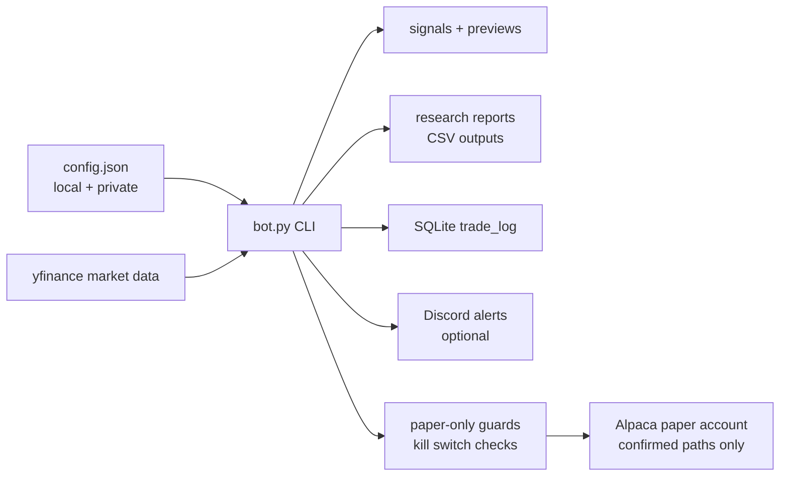

# Paper Trading Bot


A safety-first Python research and paper-trading workspace for testing market signals, producing monitoring reports, and rehearsing paper-order workflows without drifting into live trading.

The project started as a simple moving-average bot, then grew into a controlled research lab: strategy backtests, paper-readiness checks, risk previews, Discord monitoring, SQLite audit trails, and explicit kill-switch gates around anything that could touch Alpaca paper orders.

> **Important:** this is a learning and paper-trading project. It is not financial advice, does not guarantee profit, and is deliberately designed to avoid live trading.

## Why It Looks The Way It Does

Most trading-bot repos either hide the risky parts or make execution look too easy. This one does the opposite: every serious workflow is separated into preview, report, readiness, and explicitly confirmed paper-execution paths.

The goal is not "press button, make money." The goal is disciplined iteration:

- research before promotion,
- preview before execution,
- paper-only before anything else,
- saved evidence before manual decisions,
- no secrets or generated trading data committed to Git.

## What It Can Do

| Area | What is implemented |
| --- | --- |
| Market monitoring | Pulls daily market data with `yfinance`, calculates signals, logs decisions, and can send Discord summaries. |
| Paper safety | Keeps Alpaca in paper mode, defaults to `dry_run`, blocks live mode, and gates paper-order paths behind explicit confirmation. |
| Research | Runs SMA, ETF rotation, adaptive momentum, QQQ trend-gate, crypto, defensive, high-growth, and multi-sleeve research reports. |
| Backtesting | Writes CSV outputs for strategy comparisons, equity curves, robustness checks, stress tests, and walk-forward style reviews. |
| Auditability | Stores trade decisions in SQLite and writes saved CSV reports for paper-readiness, risk, monitoring, and review checkpoints. |
| Operations | Includes VPS/Hermes monitoring readiness docs and report-only scheduling checks. |

## Safety Defaults

The default configuration is intentionally conservative:

```json
{
  "dry_run": true,
  "allow_shorting": false,
  "paper_kill_switch_enabled": false,
  "alpaca": {
    "paper": true
  }
}
```

The normal command:

```powershell
python bot.py
```

is monitoring-only. It may log intended actions as `monitor_only`, but it does not submit Alpaca orders or mutate live position state.

Paper-order paths are separate commands and require explicit confirmation flags. Live Alpaca mode is refused.

## Project Map

```text
paper-trading-bot/
|-- bot.py                         # Main CLI entrypoint
|-- trading_bot/                   # Config, execution, data, strategies, research modules
|   |-- strategies/                # Strategy definitions and registry
|   |-- research/                  # Backtests, reports, readiness checks, dashboards
|   `-- safety/                    # Kill switch, lockfile, QQQ100 paper-execution guards
|-- scripts/                       # Static verifiers and focused readiness checks
|-- docs/                          # Current state, runbooks, VPS/Hermes docs, command reference
|-- tests/                         # Unit tests for config, execution, paper evidence, QQQ100 alignment
|-- data/                          # Generated outputs, ignored except .gitkeep
`-- logs/                          # Runtime logs, ignored except .gitkeep
```

## Quick Start

### 1. Create a virtual environment

```powershell
python -m venv .venv
.\.venv\Scripts\Activate.ps1
python -m pip install --upgrade pip
python -m pip install -r requirements.txt
```

### 2. Create a local config

```powershell
Copy-Item config.example.json config.json
```

Keep `config.json` private. It is intentionally ignored by Git.

### 3. Run monitoring-only mode

```powershell
python bot.py
```

### 4. Run a research command

```powershell
python bot.py --compare-strategies
python bot.py --research-report
python bot.py --preview-promoted-strategies
```

### 5. Check repo safety before publishing

```powershell
python scripts\verify_repo_safety.py
```

## Common Workflows

| Goal | Command |
| --- | --- |
| Run normal monitoring | `python bot.py` |
| Run strategy comparison | `python bot.py --compare-strategies` |
| Build research ranking report | `python bot.py --research-report` |
| Preview promoted strategy signals | `python bot.py --preview-promoted-strategies` |
| Preview promoted account actions | `python bot.py --preview-promoted-actions` |
| Show saved promoted risk preview | `python bot.py --show-promoted-risk` |
| Refresh promoted review chain | `python bot.py --refresh-promoted-review` |
| Build crypto research state report | `python bot.py --crypto-research-state-report` |
| Check deployment readiness | `python bot.py --deployment-readiness-report` |
| Verify repo safety | `python scripts\verify_repo_safety.py` |


The full command catalogue lives in [docs/COMMAND_REFERENCE.md](docs/COMMAND_REFERENCE.md).
QQQ100 daily decision monitoring is included in the VPS status outputs. The saved-output-only command `python bot.py --qqq100-daily-decision-report` can report `qqq100_daily_decision_hold_no_action_aligned_long` when QQQ100 is already aligned long one share; `python bot.py --vps-monitoring-status` and `python bot.py --vps-daily-monitoring-summary` surface that status without approving execution, repeat/follow-up orders, or scheduling.


## Architecture



## Current Direction

The project is moving toward a carefully reviewed paper-live workflow, with QQQ100 trend-gate work as the cleanest current paper-live candidate and broader multi-sleeve/crypto/high-growth research kept behind report-only review boundaries.

Useful docs:

- [Current State](docs/CURRENT_STATE.md)
- [Paper Live Checklist](docs/PAPER_LIVE_CHECKLIST.md)
- [V2 Roadmap](docs/V2_ROADMAP.md)
- [VPS Setup Checklist](docs/VPS_SETUP_CHECKLIST.md)
- [Hermes Workflow](docs/HERMES_WORKFLOW.md)
- [Command Reference](docs/COMMAND_REFERENCE.md)

## Guardrails

- Do not commit `config.json`, `.env`, API keys, Discord webhooks, databases, logs, generated CSVs, or charts.
- Do not enable live trading.
- Do not treat research reports as execution approval.
- Do not schedule execution-capable commands.
- Do not connect new strategies to paper execution without a separate readiness review.

## Disclaimer

This repository is for education, research, and paper-trading workflow development only. Markets are risky, backtests can mislead, and paper trading does not prove live-trading performance.
